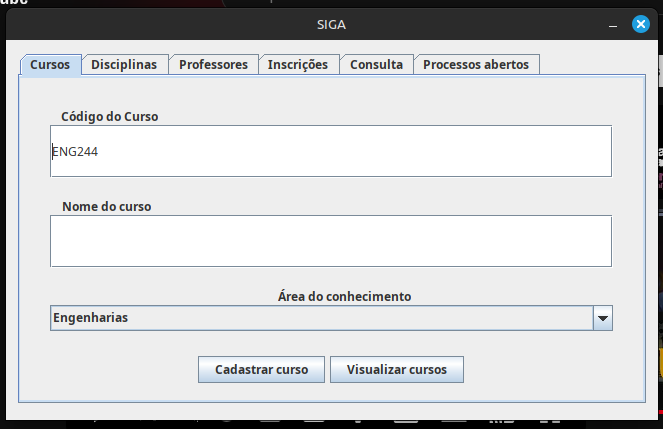
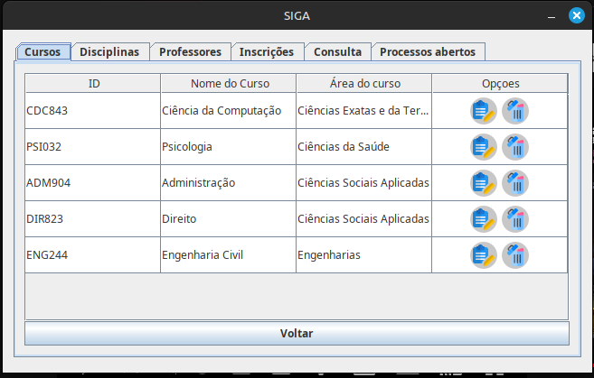
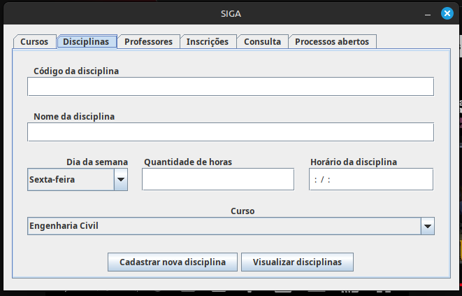
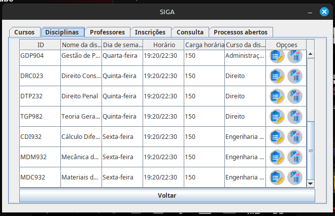
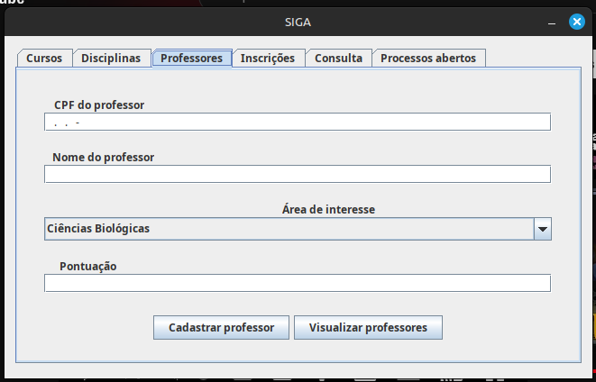
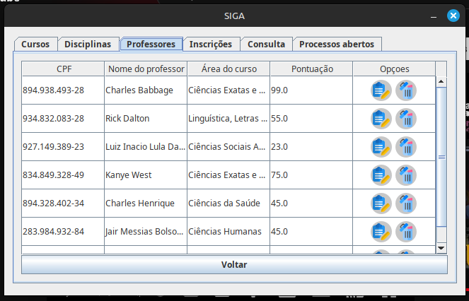
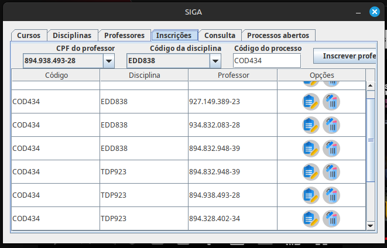
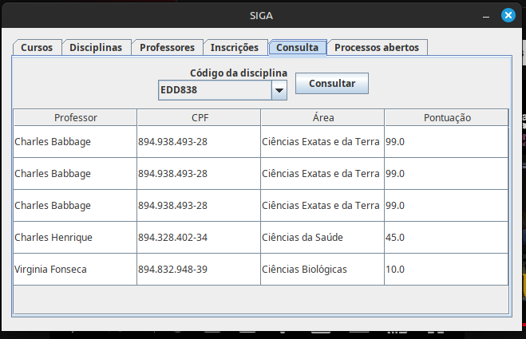
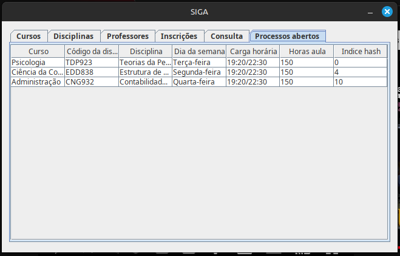

<h1 align="center"> 👨‍💻 Trabalho Semestral | ED </h1>

## 💡 Tecnologias

   
    

## 📌 Informações

- Desenvolvido por Gabriel Ferreira Amorim.
- <a href="https://drive.google.com/file/d/1-qrHifceiXBXUKEyZVL-EFgnWXSyZGcQ/view">Domínio do projeto</a>

### 🔧 Pré-requisitos

- Uma IDE Java.
- JDK instalado na sua máquina. (v21.0.6 em diante)

### 📷 Fotos

	
  
  
  
  
  
  
  
    

